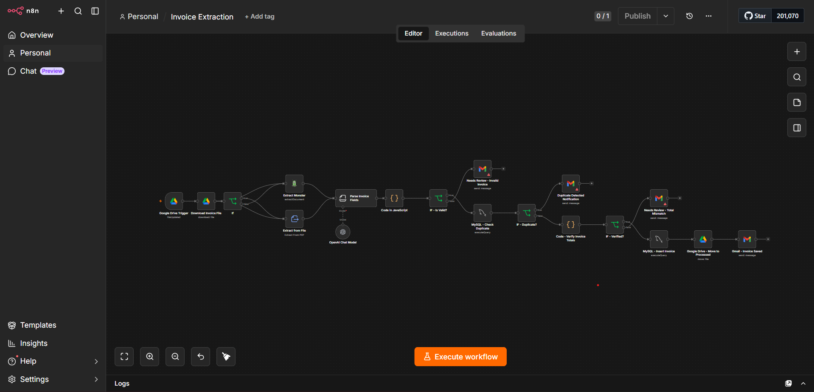

# 🧾 Invoice Extraction Workflow (n8n)

An automated n8n workflow that watches a Google Drive folder for new invoices, extracts structured data from them using AI, validates the data, checks for duplicates, stores everything in MySQL, and sends email notifications along the way.



> ⚠️ **Note on the red warning icons in the screenshot:** Several nodes in the screenshot show a small red triangle. That's **not a bug** — it just means those nodes are missing valid credentials. I removed my personal credentials before uploading this workflow to GitHub, so n8n flags those nodes as "unconfigured." Once you connect **your own** credentials (see [Setup](#-setup) below), the warnings will disappear.

---

## 🔧 What this workflow does

1. **Google Drive Trigger** – Watches a specific Drive folder for new/updated files.
2. **Download Invoice File** – Downloads the file that triggered the workflow.
3. **If (file type check)** – Routes PDF files vs. other file types down different paths.
4. **Extract Monster / Extract from File** – Extracts raw text/data from the invoice (PDF parsing).
5. **Parse Invoice Fields** – Uses an AI Information Extractor (backed by an OpenAI Chat Model) to pull out structured fields: invoice number, vendor name, dates, subtotal, tax, total, currency, and line items.
6. **Code in JavaScript** – Post-processes/cleans the extracted JSON.
7. **IF – Is Valid?** – Checks whether required fields were extracted successfully.
   - ❌ If invalid → **Needs Review – Invalid Invoice** (sends an email alert).
8. **MySQL – Check Duplicate** – Queries the database to see if this invoice already exists.
9. **IF – Duplicate?**
   - ✅ If duplicate → **Duplicate Detected Notification** (email alert).
10. **Code – Verify Invoice Totals** – Recalculates line items to confirm the total matches.
11. **IF – Verified?**
    - ❌ If mismatched → **Needs Review – Total Mismatch** (email alert).
12. **MySQL – Insert Invoice** – Saves the validated invoice data into the database.
13. **Google Drive – Move to Processed** – Moves the file into a "Processed" folder.
14. **Gmail – Invoice Saved** – Sends a final confirmation email.

---

## 📦 Requirements

- A running [n8n](https://n8n.io/) instance (self-hosted or cloud)
- The following n8n credentials (all removed from this repo — you'll add your own):
  - **Google Drive OAuth2** – for the trigger, download, and move-to-processed steps
  - **OpenAI API** – for the AI-based field extraction
  - **Extract Monster API** – for invoice/PDF text extraction
  - **MySQL** – for duplicate checking and storage
  - **Gmail OAuth2** – for sending notification emails
- A MySQL table named `invoices` (adjust the `INSERT`/`SELECT` queries in the workflow to match your schema)
- A Google Drive folder to watch, and a separate "Processed" folder to move completed files into

---

## 🔐 About credentials in this repo

For security, I **removed all of my real credential references** from `Invoice_Extraction.json` before pushing this to GitHub. The credential `id` and `name` fields in the JSON have been replaced with random placeholder values like:

```json
"credentials": {
  "googleDriveOAuth2Api": {
    "id": "x7Qp2RtY9WkLmNa3",
    "name": "Google Drive account (YOUR CREDENTIAL)"
  }
}
```

These placeholder IDs **will not work** — they're just there so the workflow JSON stays valid and importable. You'll need to reconnect each credential type in your own n8n instance after importing.

I also replaced my personal Google Drive folder ID with a placeholder (`REPLACE_WITH_YOUR_FOLDER_ID` / `REPLACE_WITH_PROCESSED_FOLDER_ID`) — swap these for your own folder IDs.

---

## 🚀 Setup

1. **Import the workflow**
   - In n8n, go to *Workflows → Add Workflow → Import from File*, and select `Invoice_Extraction.json`.

2. **Reconnect credentials**
   - Click each node showing a red warning icon (Google Drive nodes, OpenAI Chat Model, Extract Monster, MySQL nodes, Gmail nodes).
   - Select or create your own credential for each service.

3. **Set your Google Drive folder IDs**
   - Open **Google Drive Trigger** and point `folderToWatch` to the Drive folder you want to monitor.
   - Open **Google Drive – Move to Processed** and set the destination folder ID.

4. **Set up your MySQL table**
   - Create an `invoices` table matching the columns referenced in the `MySQL – Insert Invoice` and `MySQL – Check Duplicate` nodes (invoice number, vendor name, dates, amounts, etc.), or adjust the SQL in those nodes to match your own schema.

5. **Update email addresses**
   - Edit the Gmail nodes (`Needs Review - Invalid Invoice`, `Duplicate Detected Notification`, `Needs Review - Total Mismatch`, `Gmail - Invoice Saved`) to send to your own inbox/team.

6. **Activate the workflow**
   - Toggle the workflow to *Active*, or run it manually with **Execute Workflow** to test.

---

## 📁 Files

| File | Description |
|---|---|
| `Invoice_Extraction.json` | The n8n workflow (credentials scrubbed) — import this into n8n |
| `workflow-screenshot.png` | Screenshot of the workflow canvas |
| `README.md` | This file |

---

## 📝 License

Feel free to use, modify, and adapt this workflow for your own invoice processing needs.
